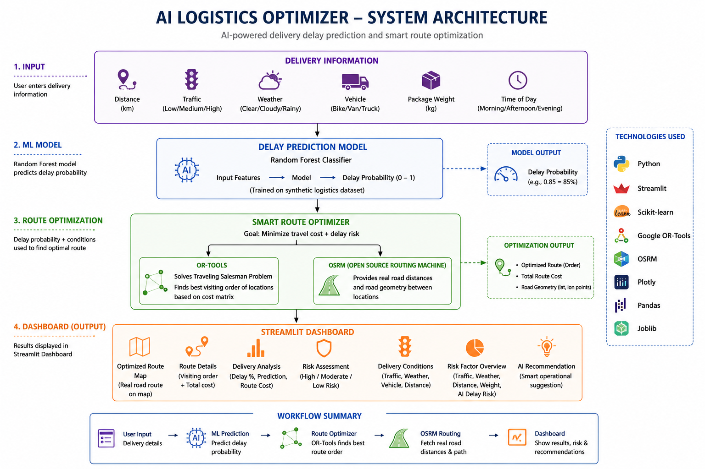

# 🚚 AI Logistics Route Optimizer

An AI-powered logistics system that predicts delivery delays and optimizes delivery routes based on operational conditions such as traffic, weather, distance, package weight, vehicle type, and time of day.

The project combines **Machine Learning, route optimization, real road routing, and an interactive Streamlit dashboard** into one end-to-end logistics prototype.

---

## 🚀 Live Demo

👉 [Try the AI Logistics Route Optimizer](https://ai-logistics-route-optimizer-4qvoajfacqmdffsclnuk9n.streamlit.app/)

---

## 🧠 Project Overview

Logistics companies need to deliver packages efficiently while dealing with uncertain conditions such as traffic, weather, package weight, and delivery distance.

This project addresses the problem in two stages:

1. **Predict the probability of delivery delay using Machine Learning**
2. **Optimize the delivery route based on delay risk and road conditions**

The final results are displayed through an interactive web dashboard.

---

## ✨ Features

- 🤖 Machine Learning-based delivery delay prediction
- 📊 Delay probability estimation
- 🛣️ Smart route optimization using Google OR-Tools
- 🌍 Real road distances using OpenStreetMap routing data
- 🗺️ Interactive road-following route map
- 🚦 Traffic risk analysis
- 🌦️ Weather risk analysis
- 📦 Package weight analysis
- 📏 Distance-based risk analysis
- ⚠️ Overall delivery risk visualization
- 🧠 AI-generated operational recommendation
- 💻 Interactive Streamlit dashboard

---

## 🏗️ System Architecture



### Workflow

```text
User Input
    ↓
Delivery Information
    ↓
Machine Learning Model
    ↓
Delay Probability
    ↓
Smart Route Optimizer
    ↓
OR-Tools + OSRM
    ↓
Optimized Route
    ↓
Streamlit Dashboard